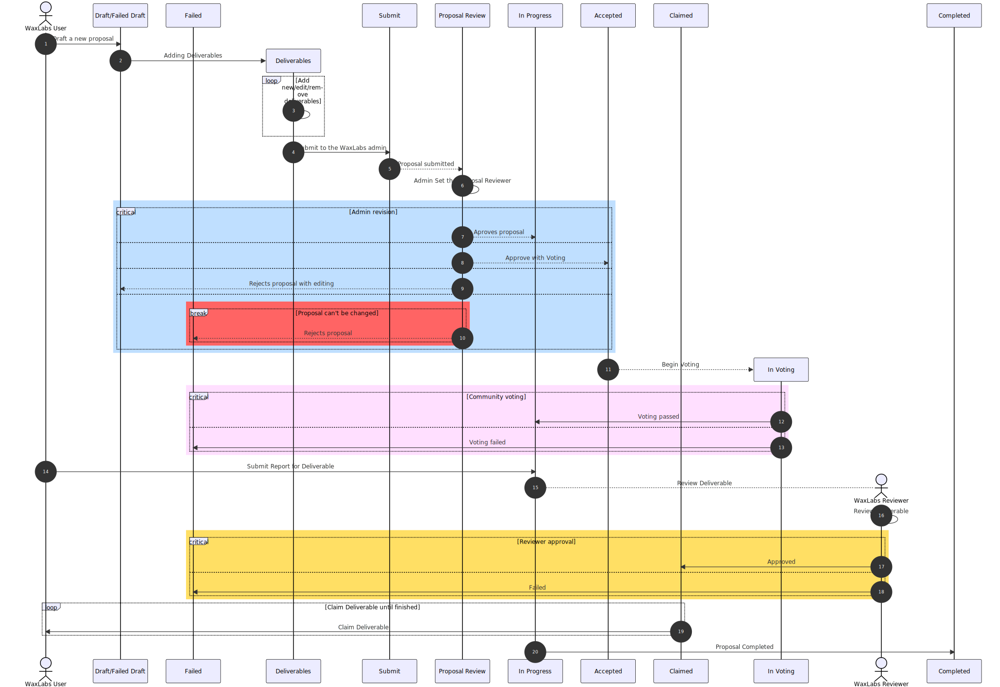

## Worflow


## Naming convention

All functions used in the project are divided into `query` and `actions` and are organized by
function affinity.

- `Query` functions use `waxClient.v1.chain.get_table_rows` directly and return a `GetTableRowsResult<T>`,
  in which `T` is an interface that is located in `@/api/models`.
- `Action` functions use `session.transact`, in which session is the current wharfkit logged interface.
    - We use a wrapper to easily execute multiple actions simultaneously.
    - This wrapper is located in `@/api/chain/actions/execute.ts` and should be used instead of the raw interface.
    - The functions that execute the chain actions do not usually start and/or end with `get`/`set`, instead they
      try to express the function objective.
    - Functions that create the chain payload are prefixed with `create` and suffixed with `Action`
      (as in `createSetAdminAction`) and they are located in the `create` folder within the `actions` folder.

## Proposal flow

### Create proposal

In order to create a proposal, the proposer must have a profile created and at least `100.00000000 WAX` in their
account.

This information can be obtained by using the function `accountHasBalance({ actor })`.

If the actor **DOES NOT** have enough balance for creating a proposal, we will add an extra action to the
`createProposal`<sup>*</sup> function:

```typescript
const response = createTransferFundsAction({session: session!})
```

This action does the following:

- transfer dummy funds from the WaxLabs contract.
- The funds will be transferred back to the WaxLabs contract, since it is a fee for creating **new** proposals.

When a proposal is created, it is sent to a `DRAFT` state, because we cannot send deliverables with the proposal.

<small>* This action does not return the proposal ID, only the transaction ID,
which can be used to track the proposal ID. The default behaviour of the previous WaxLabs version was to
redirect the users to the `My Proposals` page.</small>

##### Requirements

- Only the proposer can execute this action.

---

### Editing proposals

Only a proposal with the `DRAFT` or `FAILED_DRAFT` status can be edited, if the proposal is in another state,
the contract will raise an error.

The recommended approach is to use the `editProposal` function. However, if more than one action needs to be executed,
the `createEditProposalAction` function should be used instead.

##### Requirements

- Only the proposer can execute this action.

---

### Adding deliverables

Deliverables must be added to proposals with the `DRAFT` status, and raise an error or redirect to the proposals page
otherwise.
The deliverables should be created using the `addDeliverable` or `addDeliverables` functions, depending on how many
deliverables will be created.

```typescript
const response = await addDeliverable({
    session: session!,
    deliverableId,
    proposalId,
    requestedAmount,
    recipient,
    smallDescription,
    daysToComplete,
})
```

If the proposal also needs to be updated, it is recommended to use the `createAddDeliverableAction` function directly to
build your own custom actions array.

There are **NO** status changes for the proposal if there are only additions in deliverables.

##### Requirements

- Only the proposer can execute this action.
- Proposal status must be `DRAFT` or `FAILED_DRAFT`.
- The `recipient` account must have a WaxLabs profile. This is required.
- The `smallDescription` string must be 80 characters or shorter.
- The `requestedAmount` value should not be higher than the proposal requested amount.

---

### Removing deliverables

Deliverables can be removed using the `removeDeliverable` function. If multiple actions have to be executed simultaneously,
use the `createRemoveDeliverableAction` action directly instead.

```typescript
const response = await removeDeliverable({session: session!, deliverableId, proposalId})
```

After removing a deliverable, if the proposal status was `FAILED_DRAFT`, it will be updated to the `DRAFT` status.

##### Requirements

- Only the proposer can execute this action.
- Proposal status must be `DRAFT` or `FAILED_DRAFT`.

---

### Editing deliverables

Deliverables can be edited using the `editDeliverable` function. If multiple actions have to be executed simultaneously,
use the `createEditDeliverableAction` action directly instead.

```typescript
const response = await editDeliverable({
    session: session!,
    deliverableId,
    proposalId,
    newRequestedAmount,
    newRecipient,
    smallDescription,
    daysToComplete,
})
```

After editing a deliverable, if the proposal status was `FAILED_DRAFT`, it will be updated to the `DRAFT` status.

##### Requirements

- Only the proposer can execute this action.
- Proposal status must be `DRAFT` or `FAILED_DRAFT`.
- Deliverable status must be `DRAFT`.
- The `newRecipient` account must have a WaxLabs profile. This is required.
- The `smallDescription` string must be 80 characters or shorter.
- The `newRequestedAmount` value should not be higher than the proposal requested amount.

---

### Submit Proposal

After all deliverables are added and the proposal is finalized, it can be submitted to the WAX Labs admin for review.
The `submitProposal` function should be used for the submission.

##### Requirements

- Only the proposer can execute this action.
- The proposal total requested funds (`total_requested_funds` prop in the proposal object) value must be within the
  minimum and maximum request values of the WAX Labs contract.
  These request values can be queried from the global config object:

  ```typescript
  import {useConfigData} from "./useConfigData";
  
  const {configs} = useConfigData();
  
  console.log(configs.parsed_max_requested, configs.parsed_min_requested);
  ```

  If a proposal's `total_requested_funds` value is not within the acceptable range, it cannot be submitted for review.

- The proposal status must be `DRAFT`.

After a proposal is submitted, it **CANNOT** be edited, and it is sent to the WAX Labs admin for review.

---

### Set Reviewer

Once a proposal is submitted, the WAX Labs admin can assign it to any one account that is present in the 
WaxLabs Contract for review. The assigned reviewer must have a WaxLabs profile.

This action can be executed by using the `setReviewer` function:

```typescript
const response = await setReviewer({newReviewer, deliverableId, proposalId, session});
```

##### Requirements

- Only the admin can execute this action.
- The proposal status must be one of the following:
  - `SUBMITTED`
  - `APPROVED`
  - `VOTING`
  - `IN_PROGRESS`


---

### Review Proposal

After the proposal is submitted it can be reviewed by the WAX Labs admin, using the `reviewProposal` or
`skipVoting` functions.

```typescript
const response = await reviewProposal({session: session!, proposalId, approve, draft, memo})
```

```typescript
const response = await skipVoting({session: session!, proposalId, memo})
```

##### Requirements

- Only the admin can execute this action.
- The proposal status must be `SUBMITTED`.
- The proposal must have a reviewer set.

The possible outcomes of a proposal review are:

- **Approved**: The proposal is approved and its status as well as the associated deliverables' status
are set to `IN_PROGRESS`.
  - The `skipVoting` function can be used if the proposal does not require further approval from the community.

- **Approved with voting**: The proposal is approved and its status is set to `APPROVED`.
  - The `reviewProposal` function can be used if the proposal requires further approval from the community.

- **Rejected**: The proposal is rejected and its status is set to either `FAILED` or `FAILED_DRAFT`.
    - If the proposal is completely rejected (`FAILED` status), it **CANNOT** be edited.
    - Editing is enabled if the review still allows it (`FAILED_DRAFT` status). For that, the WAX Labs admin 
      must set the `draft`* flag to `true` when submitting the proposal review. 

<small>* In the previous WAX Labs version, `draft` was associated with community voting being required.</small> 

---

### Start Proposal Voting

As soon as a proposal is approved, community voting can be started. The `beginVoting` function can be used for that,
given that the proposer/actor owns at least a value of `10.00000000 WAX` on the WaxLabs Contract. If not, the same
logic of the `createProposal` function is used and the transfer funds actions are added.

```typescript
const response = await beginVoting({session: session!, ballotName, proposalId})
```

<small>* The `ballotName` is a random Antelope name (12 characters required).</small>

After the community voting has started, the proposal status is then updated to `VOTING` and the `vote_end_time`
prop is set to a date using the following equation*:

```text
vote_end_time = NOW() + configs.vote_duration
```

<small>* There is no need to calculate the `vote_end_time` date when using the action, as this is done automatically.</small>

##### Requirements

- Only the proposer and the WAX Labs admin can execute this action.
- The proposal status must be `APPROVED`.

---

### Voting 

When a proposal is **Approved with Voting**, the community can vote for the proposal until the WAX Labs admin ends the
voting period or the minimum voting required is achieved. 
If a successful voting process is achieved, the proposal status is set to `IN_PROGRESS`, otherwise it is set to `FAILED`.

Voting should be handled with the function: 

```typescript
const response = await vote({ballotName, voteOption, session});
```

In which `ballotName` is the name set in the proposal object (`ballot_name`) itself and `voteOption` is the option obtained
from the `ballotOptions` function.

##### Requirements

- Any user with a Wax Chain account.

---

### End Proposal Voting

After the voting period has ended, the `endVoting` action can be used to close the proposal voting.

The proposal will not have its status changed if the voting is closed.

##### Requirements

- Only the proposer and the WAX Labs admin can execute this action.
- The proposal status must be `VOTING`.

---

### Submit Report

Once a proposal is approved by both the WAX Labs admin and the community (given that total community voting has
reached a value higher than the minimum set in the WaxLabs Contract) the proposal status is set to `IN_PROGRESS`
and deliverable reports can be submitted by executing the `submitReport` action.

##### Requirements

- Only the proposer and the WAX Labs admin can execute this action.
- The proposal status must be `IN_PROGRESS`.
- The deliverable status must be `IN_PROGRESS`.

---

### Reviewing a deliverable

After a reviewer has been assigned to a proposal for review and a deliverable report has been submitted,
it can be evaluated by the reviewer.

If the WaxLabs Contract does not have enough funds to pay for the current proposal deliverable, the action will fail when
the reviewer accepts this deliverable.

This action can be executed with the `reviewDeliverable` function:

```typescript
const response = await reviewDeliverable({
    session: session!,
    proposalId,
    deliverableId,
    accept,
    memo,
})
```

If the reviewer accepts the deliverable, its status is changed to `ACCEPTED` and the deliverable funds value can be claimed.  
If the reviewer rejects the deliverable, its status is changed to `REJECTED` and the deliverable **CANNOT** be edited,
removed, or have its funds value claimed.

##### Requirements

- The WAX Labs admin must have set a reviewer for the proposal.
- Only a reviewer can execute this action.
    - This information is available in the proposal object as `reviewer`.
- The proposal status must be `IN_PROGRESS`.
- The deliverable status must be `REPORTED`.
    - The `REPORTED` status is set when the deliverable is submitted.

---

### Claiming funds

As soon as a deliverable has its status changed to `ACCEPTED`, the deliverable funds value can be claimed.
This action can be executed using the `claimFunds` function:

```typescript
const response = await claimFunds({
    session: session!,
    proposalId,
    deliverableId,
})
```

When the deliverable funds value is claimed, its status is changed to `CLAIMED`.

Once the last deliverable funds value is claimed, the proposal status is changed to `COMPLETED`.

##### Requirements

- Only the proposer or the recipient can execute this action.
- The proposal status must be `IN_PROGRESS`.
- The deliverable status must be `ACCEPTED`.

---

### Cancel Proposal

The `cancelProposal` function should only be used for this purpose.
The `memo` property is not required and can be ignored.

##### Requirements

- Only the proposer and the WAX Labs admin can execute this action.
- The proposal status must be one of the following:
  - `DRAFTING`
  - `SUBMITTED`
  - `APPROVED`
  - `VOTING`
  - `FAILED_DRAFT`

---

### Delete Proposal

After the proposal lifecycle has ended, the proposal can be deleted using the `deleteProposal` function.
This action will completely erase both the proposal and its deliverables from the chain.

##### Requirements

- Only the proposer and the WAX Labs admin can execute this action;
- The proposal status must be one of the following:
  - `FAILED`
  - `CANCELLED`
  - `COMPLETED`

---
